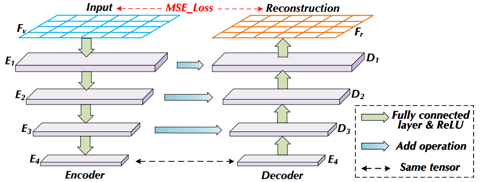

### Portray Learning: A Novel Learning Paradigm for Streaming Emerging Class Detection


## Introduction

Portray Learning is a novel learning paradigm to tackle the problem of streaming emerging class detection. It contains a series of portrayers that correspond one-to-one with data classes. Then realize known class classification and unknown class detection through multiple independent outlier identification tasks. Meanwhile, the Extreme Value Theory (EVT) is used to automatically determine the outlier threshold. 

## Requirements

```bash
pip install scipy
pip install numpy
pip install pandas
pip install tqdm
pip install matplotlib
pip install sklearn
pip install torch
```

## Model Architecture

The model architecture is stored in ./code/portrayer.py. 
```bash
portrayer.py
```



## Outlier Detection

The Extreme Value Theory (EVT) calculations is stored in ./code/evt.py. 
```bash
evt.py
```

## Simulated Stream

A demo of the simulated data stream based on KDDCup 99 is stored in ./code/data_loader.py. 
```bash
data_loader.py
```

|Dataset | #classes | #attributes|
|:--------|:---------:|--------:|
|KDDCup 99 | 4 | 41|
|Forest Cover | 7 | 10|
|HAR | 6 | 561|
|Satimage | 6 | 32|
|USPS | 10 | 256|
|Pendigits | 10 | 16|

## Running

To perform this test code, enter the ./code/ folder, run with
```bash
python main_process.py
```

## Real-World Stream

A real-world stream from New York Times API is used that includes 10k new items involving 8 classes, i.e. "Arts", "Business Day", "Fashion & Style", "N.Y./Region", "Sports", "Technology", "U.S.", "World". The ./code/real/real_stream.json stores the real-world data stream distribution. 


### References
- [Classification Under Streaming Emerging New Classes: A Solution Using Completely-Random Trees](http://aaai.org/ocs/index.php/AAAI/AAAI17/paper/view/14514), Xin Mu, Kai Ming Ting, Zhi-Hua Zhou - TKDE 2017

- [Streaming Classification with Emerging New Class by Class Matrix Sketching](https://doi.org/10.1109/TKDE.2017.2691702), Xin Mu, Feida Zhu, Juan Du, Ee-Peng Lim, Zhi-Hua Zhou - AAAI 2017

- [Semi-Supervised Streaming Learning with Emerging New Labels](https://ojs.aaai.org/index.php/AAAI/article/view/6186), Yong-Nan Zhu, Yu-Feng Li - AAAI 2020

- [Anomaly Detection in Streams with Extreme Value Theory](https://doi.org/10.1145/3097983.3098144), Alban Siffer, Pierre-Alain Fouque, Alexandre Termier, Christine Largouët - KDD 2017

- [Robust Random Cut Forest Based Anomaly Detection on Streams](http://proceedings.mlr.press/v48/guha16.html), Sudipto Guha, Nina Mishra, Gourav Roy, Okke Schrijvers - ICML 2016

- [Isolation Forest](https://doi.org/10.1109/ICDM.2008.17), Fei Tony Liu, Kai Ming Ting, Zhi-Hua Zhou - ICDM 2008

- [Robust High Dimensional Stream Classification with Novel Class Detection](https://doi.org/10.1109/ICDE.2019.00128), Zhuoyi Wang, Zelun Kong, Swarup Chandra, Hemeng Tao, Latifur Khan - ICDE 2019
